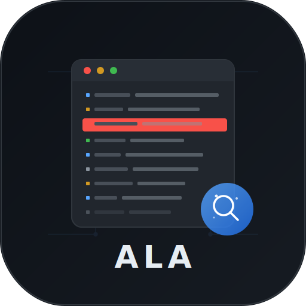
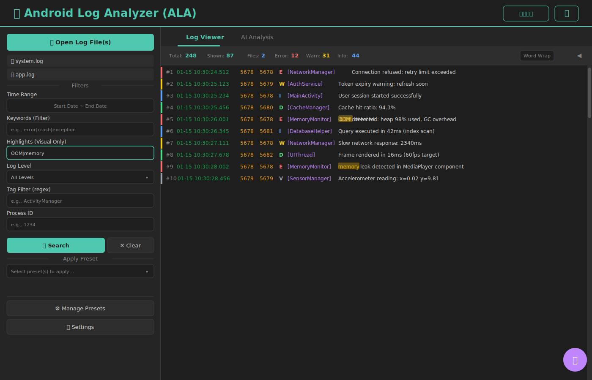

# ALA - Android Log Analyzer

<p align="center">
  
</p>

<p align="center">
  <strong>An Electron-based desktop application for analyzing Android logs with AI-powered insights.</strong><br>
  Built with TypeScript, featuring a Node.js backend and a modern UI styled with TailwindCSS.
</p>

<p align="center">
  
  
  
  
  
</p>

## 📸 Screenshot

<p align="center">
  
</p>

*Component-based React + TypeScript architecture with dark-themed interface, syntax-highlighted log viewer, advanced filtering controls, Import/Export filters, and AI-powered analysis*

## Features

- 📱 **Android Log Parsing**: Parse standard Android logcat format line by line
- 🔍 **Advanced Filtering**: Filter logs by:
  - Time range (start/end timestamps)
  - Keywords with **regex support** (e.g., `error|crash|exception`)
  - Log level (Verbose, Debug, Info, Warning, Error, Fatal)
  - Tag patterns (regex support)
  - Process ID (PID)
- 📁 **Multiple File Support**: Open and analyze multiple log files simultaneously
- 💾 **Filter Management**:
  - Save/Load filters in browser localStorage
  - **Import/Export filters** to/from JSON files
  - Share filter configurations with your team
- 🎯 **Keyword Highlighting**: Matched keywords highlighted in yellow in the log viewer
- 🤖 **AI Analysis**: Integrate with OpenAI to analyze logs and get insights about:
  - Errors and warnings
  - Potential crashes
  - Performance concerns
  - Notable patterns
  - Debugging recommendations
- ⚛️ **Modern Architecture**:
  - **React + TypeScript** renderer with component-based design
  - Webpack bundling for optimized builds
  - Context isolation for enhanced security
  - Props-based component communication
- 💻 **Modern UI**: Clean, dark-themed interface styled with TailwindCSS featuring:
  - Real-time log viewer with syntax highlighting
  - Statistics dashboard
  - Tabbed interface for logs and AI analysis
  - Responsive design

## Installation

### Prerequisites

- Node.js 18+ and npm
- (Optional) OpenAI API key for AI analysis features

### Setup

1. Clone the repository:
```bash
git clone https://github.com/kagawagao/ala.git
cd ala
```

2. Install dependencies:
```bash
npm install
```

3. (Optional) Configure AI features:
```bash
# Set your OpenAI API key
export OPENAI_API_KEY='your-api-key-here'
```

## Usage

### Running the Application

```bash
# Compile TypeScript and start in development mode
npm run dev

# Compile TypeScript and start in production mode
npm start

# Just compile TypeScript
npm run build:ts

# Just compile CSS
npm run build:css
```

### Building the Application

```bash
# Build for your current platform
npm run build
```

The built application will be available in the `dist/build` directory.

### Running Tests

```bash
# Run backend unit tests
npm test
```

All 8 backend tests validate log parsing, filtering, and statistics functionality.

### Using the Application

1. **Open a Log File**
   - Click "Open Log File" button
   - Select an Android log file (.log or .txt)
   - The log will be parsed and displayed

2. **Filter Logs**
   - **Time Range**: Enter start/end times in format `MM-DD HH:MM:SS.mmm`
   - **Keywords**: Enter space-separated keywords to search
   - **Log Level**: Select specific log level or "All"
   - **Tag Filter**: Enter regex pattern to filter by tag
   - **PID**: Filter by specific process ID
   - Click "Apply Filters" to filter, or "Clear" to reset

3. **Analyze with AI**
   - Load and optionally filter your logs
   - (Optional) Enter a specific question or analysis request
   - Click "Analyze with AI" button
   - View results in the "AI Analysis" tab

### Example Log Format

ALA supports standard Android logcat format:

```
MM-DD HH:MM:SS.mmm  PID  TID LEVEL TAG: MESSAGE
```

Example:
```
01-15 10:30:25.123  5678  5678 I MyApp: Application started
01-15 10:30:25.234  5678  5678 E MyApp: Connection failed
```

See `examples/sample-android.log` for a complete example.

## Project Structure

```
ala/
├── src/
│   ├── main.ts                 # Electron main process (TypeScript)
│   ├── backend/
│   │   ├── log-analyzer.ts     # Log parsing and filtering logic (TypeScript)
│   │   └── ai-service.ts       # AI integration service (TypeScript)
│   └── renderer/
│       ├── index.html          # UI markup
│       ├── input.css           # TailwindCSS source
│       ├── styles.css          # Compiled CSS
│       └── renderer.js         # UI logic and IPC communication
├── test/
│   └── test-backend.ts         # Backend unit tests (TypeScript)
├── assets/
│   ├── logo.svg                # Application logo
│   └── screenshot.svg          # UI screenshot
├── examples/
│   └── sample-android.log      # Example log file
├── dist/                       # Compiled JavaScript (gitignored)
├── tsconfig.json               # TypeScript configuration
├── tailwind.config.js          # TailwindCSS configuration
├── package.json
└── README.md
```

## Technologies

- **TypeScript**: Strongly-typed programming language for backend
- **Electron**: Desktop application framework
- **Node.js**: Backend runtime
- **TailwindCSS**: Modern utility-first CSS framework for styling
- **OpenAI API**: AI-powered log analysis
- **HTML/CSS/JavaScript**: UI implementation

## Log Levels

- **V** (Verbose): Detailed debug information
- **D** (Debug): Debug messages
- **I** (Info): Informational messages
- **W** (Warning): Warning messages
- **E** (Error): Error messages
- **F** (Fatal): Fatal errors

## Configuration

### Environment Variables

- `OPENAI_API_KEY`: Your OpenAI API key (required for AI features)

## Development

### Project Architecture

The application follows a standard Electron architecture:

- **Main Process** (`main.js`): Handles IPC communication, file operations, and coordinates backend services
- **Renderer Process** (`renderer/`): Handles UI rendering and user interactions
- **Backend Services** (`backend/`): Pure Node.js modules for log processing and AI integration

### Adding Features

1. Backend logic goes in `src/backend/`
2. UI components go in `src/renderer/`
3. IPC handlers in `src/main.js`

## License

MIT License - see LICENSE file for details

## Author

Jingsong Gao

## Contributing

Contributions are welcome! Please feel free to submit a Pull Request.
