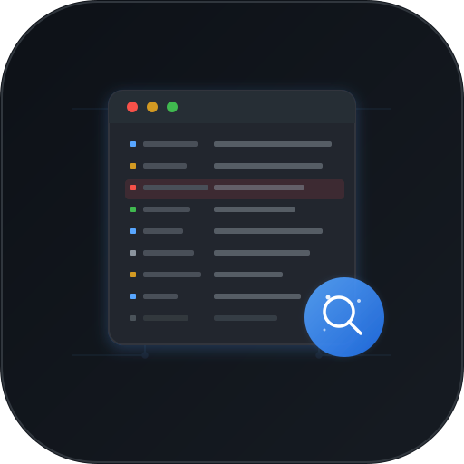

# ALA — Android Log Analyzer

<p align="center">
  
</p>

[](https://github.com/kagawagao/ala/actions/workflows/build.yml)

A full-stack tool for analyzing **Android logcat** files, **tcpdump pcap** files, and **Perfetto trace** files, powered by AI. Supports both upload-based analysis and **lazy local log analysis** — point ALA at a local file or directory path, and the AI agent explores your logs on-demand with streaming tools.

## Architecture

```
ala/
├── backend/          # Python FastAPI backend
│   ├── src/ala/      # Application source
│   │   ├── api/      # REST endpoints (logs, trace, chat, config, projects)
│   │   ├── services/ # Business logic (log analyzer, trace analyzer, AI, sessions, agent tools)
│   │   └── mcp/      # FastMCP server (MCP protocol support)
│   └── tests/        # pytest test suite
└── frontend/         # React + Vite + Ant Design frontend
    └── src/
        ├── api/       # HTTP client (fetch + SSE streaming)
        ├── components/ # React UI components
        └── i18n/      # Translations (en/zh)
```

## Features

- **Android Log Analysis** — Parse, filter, and search Android logcat files
  - Support for `android_logcat`, `generic_timestamped`, `pcap`, and unknown formats
  - **Multi-file upload**: select or drag multiple `.log` / `.txt` / `.pcap` files at once
  - **Compressed archives**: upload `.gz` (single-file gzip) or `.zip` (multi-log archives) directly
  - **Network capture files**: support for `.pcap` and `.pcapng` (tcpdump) files with packet-level analysis
  - **Streaming parse**: log entries are streamed to the browser as they are parsed — no large JSON body, instant first-row display
  - **Virtualized list**: renders large log datasets without UI lag
  - Filters: time range, keywords (regex), log level, tag (regex), PID, TID
  - Filter presets (save/load/delete per-project or globally)
  - Color-coded log levels
  - **Export**: download filtered log entries as CSV (RFC 4180, BOM) or JSON
- **Perfetto Trace Analysis** — Analyze Perfetto `.pb` and JSON trace files
  - Extract process/thread/event summary (all slices, not just top 20)
  - Top slices by duration with virtualized rendering
  - FTrace events
  - **Process filter**: filter the trace view by PID list or process name regex
- **AI Assistant** — Multi-turn conversation with streaming responses
  - Analysis presets: General, Crash, Performance, Security
  - Attach log/trace data or local file/directory paths as conversation context
  - **Agentic analysis**: AI uses tools (`query_log_overview`, `search_logs`, `list_log_files`, `query_trace_overview`, `list_trace_processes`, `query_trace_slices`) to iteratively explore loaded data
  - **Lazy local log analysis**: AI agent analyzes local files on-demand via streaming tools — no upload, no size cap
    - `overview_local_log` — single-pass stats (line count, levels, tags, time range)
    - `search_local_log` — regex search with pagination
    - `search_all_local` — composite tool: regex search across log + source code, merges and deduplicates results
    - `read_log_range` — precise line-range reads
    - `tail_local_log` — last N lines via ring buffer
    - **Directory support**: point ALA at a directory of logs for multi-file AI-driven analysis
  - **Extended thinking**: Anthropic extended thinking mode with configurable budget tokens
  - **Dual-provider AI**: supports Anthropic (native SDK) and OpenAI-compatible APIs (OpenAI, Ollama, Azure, LM Studio, etc.)
  - Built-in model library with presets for common models
  - Session management (create, rename, delete, export chat)
- **Projects** — Group source code paths for AI-assisted analysis
  - Scan project files to discover logging patterns
  - **Ripgrep-backed code scanner**: 265x faster than pure-Python pattern discovery
  - **AI-generated filter presets**: automatically suggest log filters based on the project's code (`Log.d/i/w/e` tags, process names, error keywords)
  - Context documents (AGENTS.md, CLAUDE.md, etc.) auto-injected into the AI system prompt
  - Project-level filter preset storage
- **MCP Server** — Expose log and trace analysis tools via Model Context Protocol
  - `parse_android_log`, `filter_android_logs`, `get_log_statistics`
  - `parse_perfetto_trace`, `filter_perfetto_trace`, `query_perfetto_trace_sql`
- **In-App User Guide** — Markdown-based guide (English / 中文) rendered with react-markdown, accessible via header button
- **i18n** — English and Chinese (中文) UI; language auto-detected from browser locale
- **Dark/light theme**

## Quick Start

### Prerequisites

- Python 3.12+ with [Poetry](https://python-poetry.org/) (`pip install poetry`)
- Node.js 20+
- Docker + Docker Compose (for production deploy)

### One-Click Scripts

Convenience scripts are provided for **Linux / macOS** (bash) and **Windows** (PowerShell).

```bash
# Linux / macOS
./scripts/ala.sh install   # install all dependencies
./scripts/ala.sh dev       # start hot-reload dev servers
./scripts/ala.sh build     # production build
./scripts/ala.sh deploy    # deploy with Docker Compose
```

```powershell
# Windows (PowerShell)
.\scripts\ala.ps1 install
.\scripts\ala.ps1 dev
.\scripts\ala.ps1 build
.\scripts\ala.ps1 deploy
```

Equivalent npm scripts are available at the workspace root:

| npm script            | Action                                         |
| --------------------- | ---------------------------------------------- |
| `npm run install:all` | Install root + backend + frontend dependencies |
| `npm run dev`         | Start hot-reload dev servers                   |
| `npm run build`       | Build frontend for production                  |
| `npm run deploy`      | `docker compose up --build -d`                 |
| `npm run deploy:down` | `docker compose down`                          |

### Manual Setup

```bash
# Install root workspace tools (prettier, husky, commitlint)
npm install

# Install backend dependencies via Poetry
cd backend && poetry install && cd ..

# Install frontend dependencies
cd frontend && npm install && cd ..

# Start both backend and frontend in parallel
npm run dev
```

The frontend will be available at `http://localhost:5173` and the backend at `http://localhost:8000`.

### Docker

```bash
# Copy environment file
cp backend/.env.example backend/.env
# Edit backend/.env to set your AI API key

# Start with Docker Compose
docker compose up -d
```

The app will be available at `http://localhost`.

### Standalone Executable

Build ALA into a single self-contained executable (no Python/Node.js required on the target machine).

**Prerequisites** (build machine only):

- Node.js 20+
- Python 3.12+ with [Poetry](https://python-poetry.org/)

**Build:**

```bash
# macOS / Linux
bash scripts/build-exe.sh

# Windows (PowerShell)
.\scripts\ala.ps1 exe
```

The build process:

1. Compiles the React frontend to `frontend/dist/`
2. Bundles the Python backend + frontend static files with PyInstaller

**Output:** `backend/dist/ala/` directory containing the `ala` (or `ala.exe`) executable and its supporting files.

**Run:**

```bash
# macOS / Linux
./backend/dist/ala/ala

# Windows
.\backend\dist\ala\ala.exe
```

The app opens in your default browser at `http://localhost:8000` automatically.

**Configure AI API Key** (optional): place a `.env` file next to the executable:

```env
AI_API_KEY=sk-ant-...
AI_MODEL=claude-sonnet-4-20250514
```

Or configure it in the app's Settings UI after launching.

**Distribute:** zip/archive the entire `backend/dist/ala/` folder — the executable requires the sibling files to run.

> **Note:** PyInstaller builds are platform-specific. Build on Windows to get a Windows binary, macOS for macOS, Linux for Linux.

### Installer Packages (GitHub Releases)

Tag releases now publish desktop install/distribution assets for multiple platforms:

- **Windows**: `.msi` installer (plus zipped standalone folder)
- **macOS**: `.dmg` package containing `ALA.app`
- **Linux**: `.tar.gz` archive of the standalone bundle

Download them from the corresponding GitHub Release assets.

## Configuration

### AI Settings

Configure AI settings in the UI (Settings button) or via environment variables in `backend/.env`:

```env
AI_API_ENDPOINT=https://api.openai.com/v1
AI_API_KEY=sk-...
AI_MODEL=gpt-4o-mini
AI_TEMPERATURE=0.7
```

The backend also supports any OpenAI-compatible API (Ollama, LM Studio, Azure OpenAI, etc.).

### MCP Server

The MCP server starts automatically when the FastAPI backend starts — no separate process required.
It is mounted at `/mcp` and uses the **Streamable HTTP** transport (MCP 1.0):

```
http://localhost:8000/mcp
```

Connect any MCP-compatible client (e.g. Claude Desktop, MCP CLI, or a custom client) to that URL.

Available MCP tools:

- `parse_android_log(log_content)` — Parse Android logcat text
- `filter_android_logs(log_content, level, tag, keywords, ...)` — Filter logs
- `get_log_statistics(log_content)` — Get log statistics
- `parse_perfetto_trace(trace_file_path)` — Parse a Perfetto trace file
- `filter_perfetto_trace(trace_file_path, pids, process_name)` — Filter trace by process
- `query_perfetto_trace_sql(trace_file_path, sql)` — Run SQL against a Perfetto trace (or list tables when sql is omitted)

## Development

### Backend

```bash
cd backend

# Run tests
poetry run pytest tests/ -v

# Start dev server
poetry run uvicorn ala.main:app --reload --port 8000

# Lint
poetry run ruff check src/
poetry run ruff format --check src/
```

### Frontend

```bash
cd frontend

# Dev server
npm run dev

# Type check
npm run type-check

# Lint
npm run lint

# Build
npm run build
```

### Code Quality

```bash
# From workspace root:

# Lint frontend
npm run lint

# Format all files
npm run format

# Check format
npm run format:check
```

Git hooks (via Husky):

- **pre-commit**: ESLint + Prettier format check
- **commit-msg**: commitlint (Conventional Commits)

## API Reference

| Method    | Path                                        | Description                                             |
| --------- | ------------------------------------------- | ------------------------------------------------------- |
| `GET`     | `/health`                                   | Health check                                            |
| `GET/PUT` | `/api/config`                               | AI configuration                                        |
| `GET`     | `/api/models`                               | List model presets (built-in + custom)                  |
| `POST`    | `/api/models`                               | Create custom model preset                              |
| `PUT`     | `/api/models/:id`                           | Update model preset                                     |
| `DELETE`  | `/api/models/:id`                           | Delete model preset                                     |
| `PATCH`   | `/api/models/:id/enabled`                   | Toggle model preset enabled/disabled                    |
| `POST`    | `/api/models/reload`                        | Reload built-in models from on-disk cache               |
| `POST`    | `/api/logs/parse`                           | Parse log files (multipart, multiple files, .gz / .zip) |
| `POST`    | `/api/logs/parse/stream`                    | Stream-parse log files as NDJSON                        |
| `POST`    | `/api/logs/parse-local`                     | Validate and scan a server-local log file path          |
| `POST`    | `/api/logs/auto-path`                       | Auto-detect Android platform-tools log path             |
| `POST`    | `/api/logs/directory/list`                  | List log files in a server-local directory              |
| `POST`    | `/api/logs/directory/parse/stream`          | Stream-parse all log files in a directory               |
| `POST`    | `/api/logs/directory/parse/selected/stream` | Stream-parse selected log files in a directory          |
| `POST`    | `/api/logs/filter`                          | Filter log entries                                      |
| `POST`    | `/api/logs/statistics`                      | Get log statistics                                      |
| `POST`    | `/api/trace/parse`                          | Parse Perfetto trace (multipart)                        |
| `POST`    | `/api/trace/filter`                         | Filter trace by process PID(s) / name regex             |
| `POST`    | `/api/chat/sessions`                        | Create chat session                                     |
| `GET`     | `/api/chat/sessions`                        | List chat sessions                                      |
| `GET`     | `/api/chat/sessions/:id`                    | Get session with messages                               |
| `GET`     | `/api/chat/sessions/:id/export`             | Export session as JSON                                  |
| `DELETE`  | `/api/chat/sessions/:id`                    | Delete session                                          |
| `POST`    | `/api/chat/sessions/:id/messages`           | Send message (SSE stream)                               |
| `PUT`     | `/api/chat/sessions/:id/trace`              | Bind parsed trace data to a chat session                |
| `PUT`     | `/api/chat/sessions/:id/logs`               | Bind parsed log data to a chat session                  |
| `PUT`     | `/api/chat/sessions/:id/file-path`          | Bind a local file path to a chat session                |
| `POST`    | `/api/projects`                             | Create project                                          |
| `GET`     | `/api/projects`                             | List projects                                           |
| `GET`     | `/api/projects/:id`                         | Get project                                             |
| `PUT`     | `/api/projects/:id`                         | Update project                                          |
| `DELETE`  | `/api/projects/:id`                         | Delete project                                          |
| `GET`     | `/api/projects/:id/files`                   | List project source files                               |
| `GET`     | `/api/projects/:id/context-docs`            | List AI context documents in project                    |
| `POST`    | `/api/projects/:id/generate-filters`        | AI-generate log filter presets (SSE stream)             |
| `GET`     | `/api/projects/:id/presets`                 | List project-level filter presets                       |
| `PUT`     | `/api/projects/:id/presets`                 | Save project-level filter presets                       |

## License

MIT — see [LICENSE](./LICENSE)
