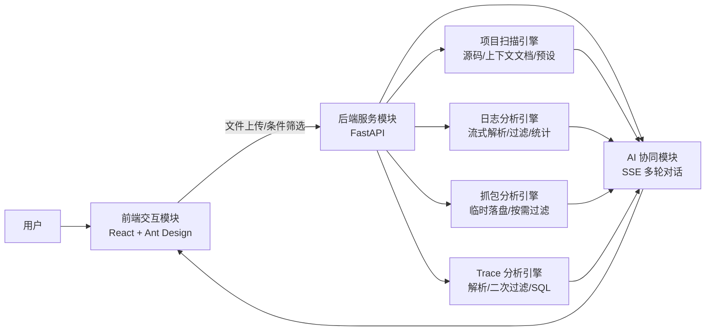
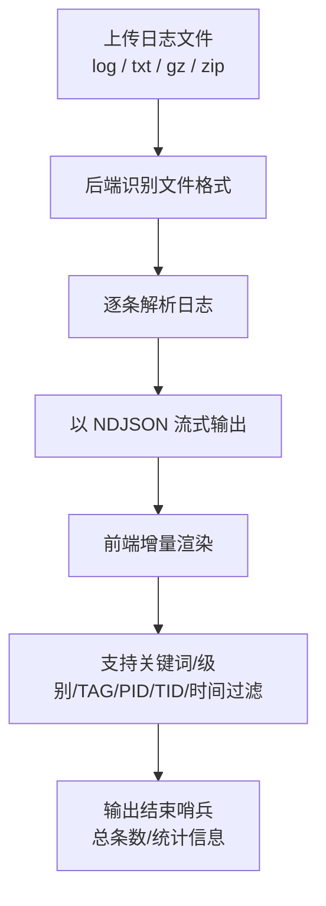
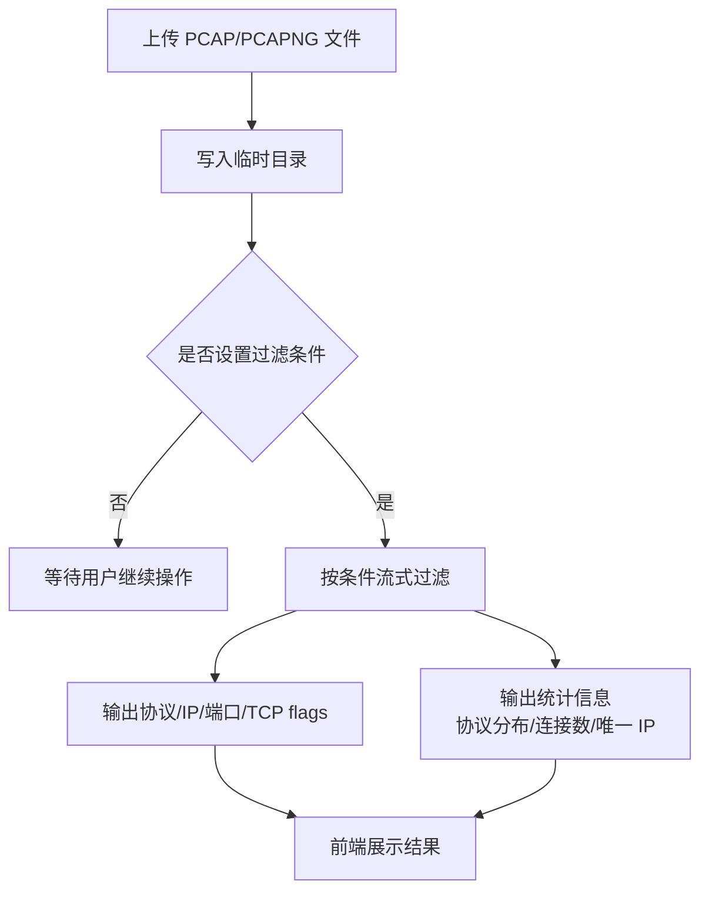
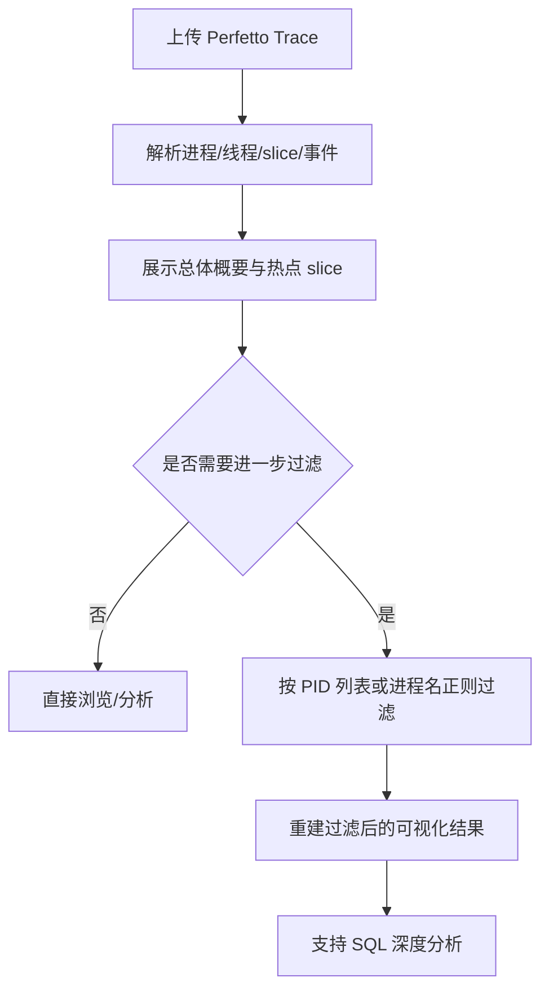
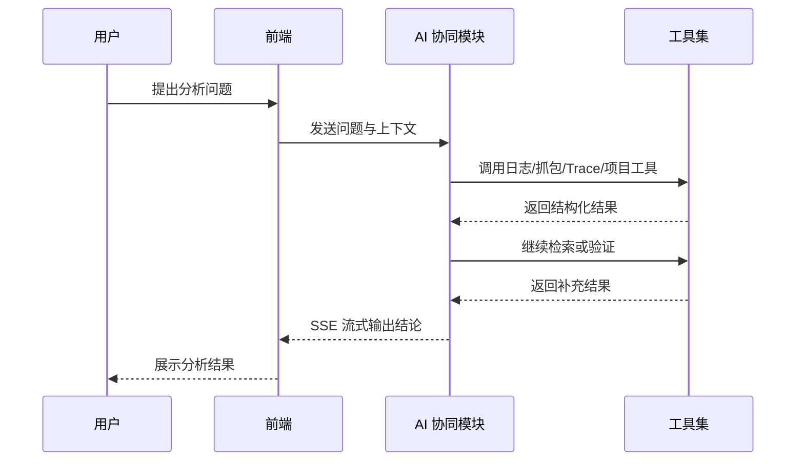
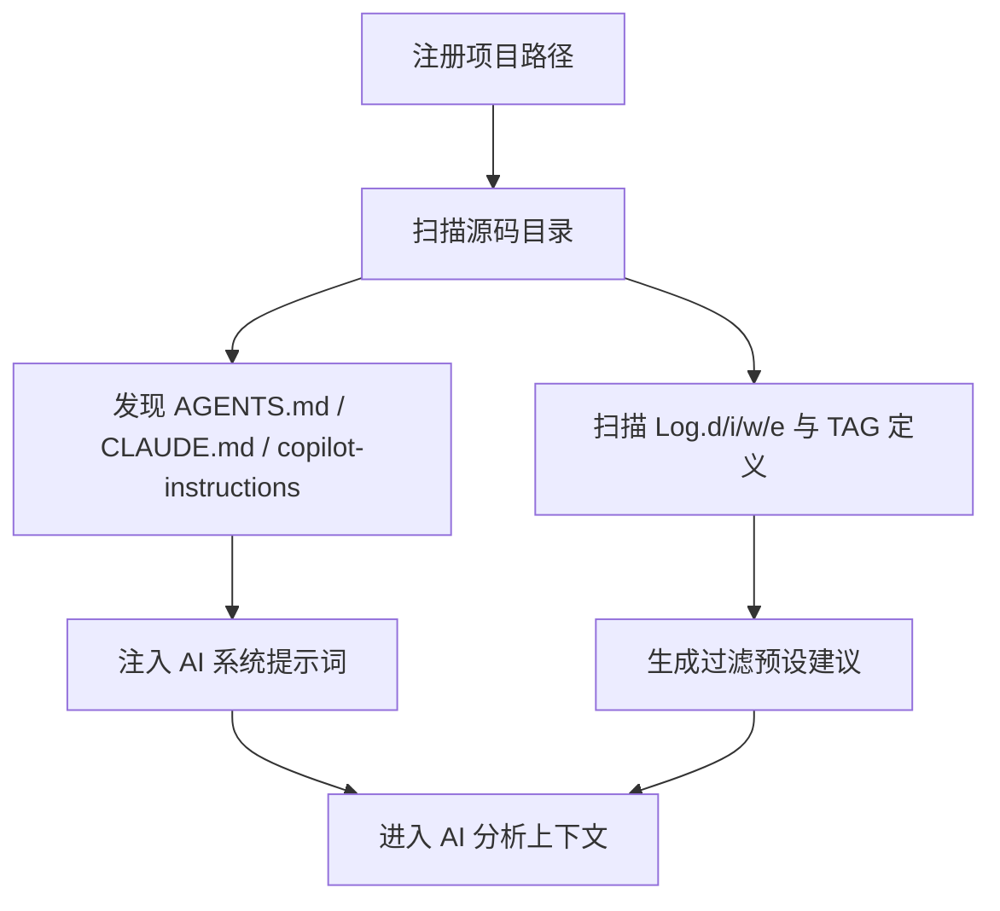

# 专利交底书

## 一、发明名称

一种面向 Android 日志、网络抓包与性能 Trace 的流式智能分析方法、系统及存储介质

## 二、技术领域

本发明属于软件智能分析与系统诊断技术领域，具体涉及一种面向 Android 终端运行数据的多模态分析方法，尤其涉及对 logcat 日志、PCAP 网络抓包、Perfetto Trace 性能轨迹进行统一接入、流式解析、按需过滤及 AI 辅助分析的方法、系统及存储介质。

## 三、背景技术

Android 应用和系统排障通常依赖日志、网络抓包与性能轨迹三类核心数据：

1. 日志用于定位异常、崩溃、状态变化与业务链路；
2. 抓包用于定位网络请求、重传、丢包、协议异常与连接问题；
3. Trace 用于定位卡顿、启动慢、线程阻塞、CPU 调度与性能瓶颈。

现有方案通常存在以下不足：

1. 数据类型割裂，日志、抓包和 Trace 分别依赖不同工具，难以形成统一诊断链路；
2. 大文件一次性加载导致等待时间长、内存占用高，交互体验差；
3. 过滤条件需要人工反复试错，分析效率低；
4. 缺少对项目源码、日志 TAG、错误关键字及上下文说明文件的自动利用；
5. 即使引入 AI，也多停留在文本问答，难以直接调用数据检索能力形成闭环分析。

因此，亟需一种能够同时支持多数据源、流式处理、按需过滤、项目上下文注入并结合 AI 工具调用的智能分析方案。

## 四、发明内容

### 4.1 要解决的技术问题

本发明旨在解决以下问题：

1. 多种 Android 运行数据来源异构、分析割裂的问题；
2. 大体量日志与抓包文件加载慢、占用资源高的问题；
3. 手工配置过滤条件效率低的问题；
4. AI 分析缺少实时工具支撑、无法形成“查找—推理—再查找”闭环的问题。

### 4.2 技术方案

本发明提供一种智能分析系统，包括前端交互模块、后端服务模块、分析引擎模块、AI 协同模块及上下文注入模块。

#### 4.2.1 前端交互模块

用于完成文件上传、目录选择、条件筛选、结果展示、AI 对话与多视图切换。

#### 4.2.2 后端服务模块

用于接收文件、执行解析、过滤、统计以及流式输出；对不同数据类型提供统一的 REST 与流式接口。

#### 4.2.3 分析引擎模块

分别处理：

1. 日志解析、过滤与统计；
2. PCAP/PCAPNG 抓包解析、过滤与统计；
3. Perfetto Trace 解析与二次过滤；
4. 项目源码扫描、上下文文档发现与过滤预设生成。

#### 4.2.4 AI 协同模块

根据用户问题及当前上下文，调用日志查询、抓包过滤、Trace SQL、文件读取等工具，执行多轮智能分析。

#### 4.2.5 上下文注入模块

自动发现项目目录中的 AGENTS.md、CLAUDE.md、.github/copilot-instructions.md 等文档，并将其作为 AI 系统提示词的一部分注入，以增强领域上下文理解能力。

### 4.3 核心方法

#### 4.3.1 日志流式分析方法

对上传的一个或多个日志文件执行如下步骤：

1. 接收普通文本、gzip 或 zip 格式日志文件；
2. 后端边解析边以 NDJSON 形式输出日志条目；
3. 前端按流接收并增量渲染，避免一次性加载全部结果；
4. 解析完成后输出结束哨兵数据，包含总条数；
5. 支持时间范围、关键词、级别、TAG、PID、TID 等过滤条件。

#### 4.3.2 抓包懒加载分析方法

对 PCAP/PCAPNG 文件执行如下步骤：

1. 上传后先写入临时目录，不立即全量解析；
2. 在用户输入过滤条件后再执行流式过滤；
3. 返回协议、源/目的 IP、端口、TCP flags 等结构化结果；
4. 同时输出统计信息，如协议分布、唯一 IP 数、连接数等；
5. 降低大文件场景下的内存占用和等待时间。

#### 4.3.3 Trace 解析与二次过滤方法

对 Perfetto Trace 文件执行如下步骤：

1. 完成 Trace 解析并提取进程、线程、slice、事件等信息；
2. 支持按 PID 列表或进程名正则进行过滤；
3. 将过滤后的结果重新构造为可视化数据；
4. 支持进一步的 SQL 查询分析。

#### 4.3.4 项目上下文自动发现方法

对用户注册的项目路径执行如下步骤：

1. 扫描项目源码目录；
2. 自动发现上下文文档，如 AGENTS.md、CLAUDE.md、copilot-instructions 等；
3. 读取并注入 AI 分析上下文；
4. 扫描源码中的日志调用模式、TAG 定义及错误关键字；
5. 基于扫描结果生成过滤预设建议。

#### 4.3.5 AI 工具协同分析方法

AI 对话过程中，系统根据需要调用以下工具能力：

1. 日志概览、搜索、过滤、统计；
2. Trace 概览、过滤、SQL 查询；
3. 抓包概览、搜索、过滤；
4. 项目文件列表、上下文文档读取；
5. 本地日志按行范围读取、尾部读取、目录日志组合分析。

AI 以“用户提问—调用工具—获取结果—继续推理”的方式完成多轮分析，而不是仅依赖单次文本回答。

### 4.4 有益效果

与现有技术相比，本发明至少具有以下有益效果：

1. 支持日志、抓包、Trace 的统一分析；
2. 通过流式解析和增量展示提升大文件交互效率；
3. 通过懒加载与按需过滤降低内存占用；
4. 自动发现项目上下文，减少人工配置成本；
5. 通过 AI 工具调用形成可执行的诊断闭环；
6. 便于扩展到 HCI、缺陷单和源码辅助分析等更多场景。

## 五、附图说明

以下为基于当前实现补充的 Mermaid 架构图与流程图，可直接作为正式附图草稿使用。

### 5.1 系统总体架构图

### 5.2 日志流式解析流程图

### 5.3 PCAP 懒加载分析流程图

### 5.4 Trace 解析与二次过滤流程图

### 5.5 AI 工具协同分析流程图

### 5.6 项目上下文自动发现流程图

## 六、具体实施方式

以下结合当前实现对本发明作进一步说明。

### 6.1 系统总体架构

系统采用前后端分离架构：

1. 前端使用 React 与组件化界面实现文件上传、过滤条件编辑、结果展示和 AI 对话；
2. 后端使用 FastAPI 提供统一 API、流式接口及静态资源服务；
3. 不同分析能力分别由日志、抓包、Trace、项目扫描与 AI 服务模块实现；
4. AI 对话过程通过 SSE 持续输出中间结果和最终结论。

### 6.2 日志分析实施例

用户上传多个日志文件后，系统识别文件格式并执行如下操作：

1. 解析出时间、级别、TAG、PID、TID、内容等字段；
2. 通过流式方式逐条发送给前端；
3. 前端使用虚拟化列表增量渲染；
4. 用户可按时间、关键词、级别、TAG、PID、TID 进行过滤；
5. 过滤结果可用于统计、定位和 AI 推理。

### 6.3 抓包分析实施例

用户上传 PCAP 文件后，系统执行如下操作：

1. 先将文件保存至临时目录；
2. 仅在用户指定过滤条件后进行处理；
3. 按协议、源 IP、目的 IP、源端口、目的端口、TCP flags 等条件筛选；
4. 返回流式结果及统计信息；
5. 以较低资源消耗支持大抓包文件的逐步分析。

### 6.4 Trace 分析实施例

用户上传 Perfetto Trace 文件后，系统执行如下操作：

1. 提取进程、线程、slice 和事件信息；
2. 显示总体概要及热点 slice；
3. 允许按 PID 或进程名正则进行二次过滤；
4. 支持进一步 SQL 查询，以便定位性能瓶颈。

### 6.5 项目上下文与 AI 协同分析实施例

当用户在 AI 面板输入“为什么应用崩溃”或“为什么请求失败”时，系统执行如下操作：

1. 读取当前会话中的日志、Trace 或抓包上下文；
2. 若绑定了项目，则自动加载项目上下文文档及源码扫描结果；
3. AI 根据问题调用日志搜索、Trace SQL、抓包过滤等工具；
4. 系统返回逐步推理结论与定位建议；
5. 如有需要，可继续调用工具进行下一轮验证。

## 七、建议保护点

建议在正式专利申请中重点保护以下技术点：

1. 多模态运行数据统一接入与分析框架；
2. 日志、抓包、Trace 的流式输出与前端增量渲染机制；
3. 抓包临时落盘与按需过滤的懒加载机制；
4. 项目上下文文档自动发现并注入 AI 提示词的机制；
5. 基于源码扫描自动生成日志过滤预设的机制；
6. AI 工具调用驱动的多轮诊断闭环。

## 八、可补充材料

如准备提交正式申请，建议补充以下材料：

1. 系统流程图；
2. 模块框图；
3. 日志流式解析时序图；
4. 抓包懒加载时序图；
5. AI 工具调用流程图；
6. 真实排障案例 1 至 2 个。
